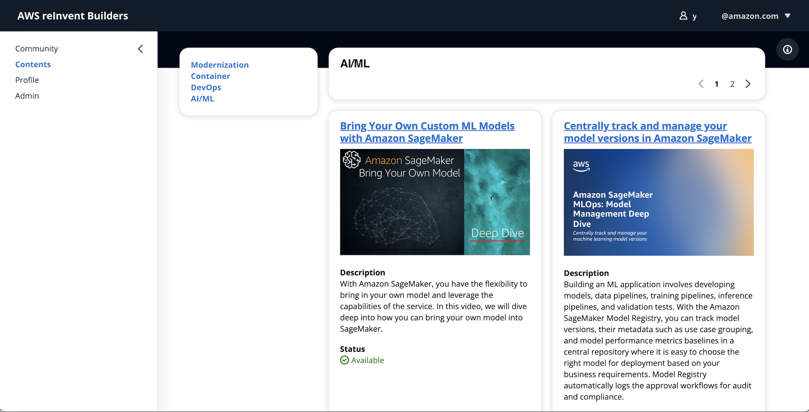

# AcademicAdvisorApp_v2 
This folder has the code artifacts to run an Academic Advisor App, using React framework, vite tool and AWS Amplify

## How to initiliaze the project

Run in sequence:

npm install 
cdk bootstrap aws://$ACCOUNT_ID/$REGION
npx ampx sandbox -----> set up a new sandbox environment
npm run dev ---------> run the starter project

### AWS CLI

Create an user in Amazon Cognito to test authentication

aws cognito-idp admin-create-user --user-pool-id USER_POOL_ID --username "testuser@testdomain.com" --temporary-password "TempPass123!" --user-attributes Name="custom:student_id",Value="1" Name="email_verified",Value="true" --message-action SUPPRESS

aws cognito-idp admin-set-user-password --user-pool-id USER_POOL_ID --username "testuser@testdomain.com" --password "FinalPass123!" --permanent

Note: Attribute student_id is a custom attribute created in the user pool. Remove it if you don´t need it. 

**Application**\

